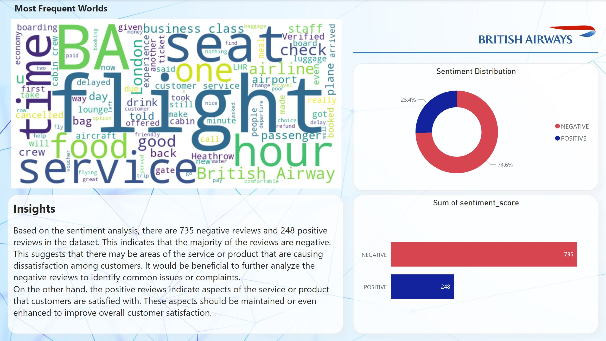

# British-Airways-Internship

## Overview

British Airways (BA) is the flag carrier airline of the United Kingdom (UK). Every day, thousands of BA flights arrive to and depart from the UK, carrying customers across the world. Whether it’s for holidays, work or any other reason, the end-to-end process of scheduling, planning, boarding, fuelling, transporting, landing, and continuously running flights on time, efficiently and with top-class customer service is a huge task with many highly important responsibilities.

As a data scientist at BA, it was my job to apply analytical skills to influence real-life multi-million-pound decisions from day one, making a tangible impact on the business as my recommendations, tools, and models will drive key business decisions, reduce costs, and increase revenue.

Customers who book a flight with BA will experience many interaction points with the BA brand. Understanding a customer's feelings, needs, and feedback is crucial for any business, including BA.

My first task was focused on scraping and collecting customer feedback and reviewing data from a third-party source and analyzing this data to present any insights I may uncover.

## Task 1

I started the task by scraping review data from the Skytrax website using a Jupyter Notebook. I executed Python code to collect comprehensive information about the airline. I organized the data into a "data" folder, mapping the file path for future analysis.

Upon obtaining the dataset, I initiated the data preparation phase to address the inherent messiness and focus on text-based reviews. Employing Python, I performed data cleaning to enhance the dataset's suitability for analysis.

For the analysis, I explored sentiment analysis and word clouds. These methods provided valuable insights into the content of the reviews, allowing me to identify key themes, sentiments, and frequently occurring words.

To present the findings, I created visualizations and metrics that encapsulate the essence of the dataset. These visuals, accompanied by clear and concise explanations, were compiled into a single PowerPoint slide.

In the slide, I highlighted significant patterns, trends, and sentiments extracted from the reviews, ensuring that the information is presented in an accessible manner. The visualizations and metrics aim to facilitate a quick understanding of the key points, making it suitable for presentation at the upcoming board meeting.

***The Visualization below was done using Microsoft Power BI***

## Task 2

Here's a summary of the tasks I completed:

### Data Exploration and Preparation
In the initial phase, I delved into the dataset using Jupyter Notebook. This allowed me to familiarize myself with the dataset's columns and gather basic statistical insights. I identified key features and pondered over potential new variables that could enhance the predictive model.

### Feature Engineering
To optimize the dataset for predictive modeling, I crafted new features that aimed to capture additional patterns or trends. These enhancements were intended to improve the overall performance of the machine learning model.

### Model Training
For the predictive task of determining if a customer would make a booking, I employed a RandomForest algorithm. This choice was driven by its ability to provide insights into the significance of each variable in the model's predictive power. The training process involved feeding the prepared dataset to the algorithm to learn the underlying patterns.

### Model Evaluation
Post-training, I rigorously evaluated the model's performance using cross-validation techniques. This involved assessing various evaluation metrics to gauge the model's accuracy, precision, recall, and other relevant indicators. The goal was to ensure that the model was robust and reliable in making predictions.

### Variable Contribution Visualization
To interpret the model's inner workings, I created visualizations that illustrated how each variable contributed to the predictive power. This not only provided a clearer understanding of the model but also facilitated communication of the results to non-technical stakeholders.

Findings Presentation
Summarizing the outcomes in a concise manner, I utilized PowerPoint to craft a presentation slide. This slide encapsulates the key findings, the model's performance metrics, and visual representations of variable contributions. The goal is to succinctly communicate the model's effectiveness and insights to our manager.

